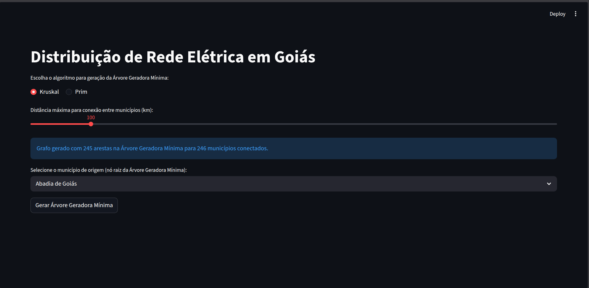
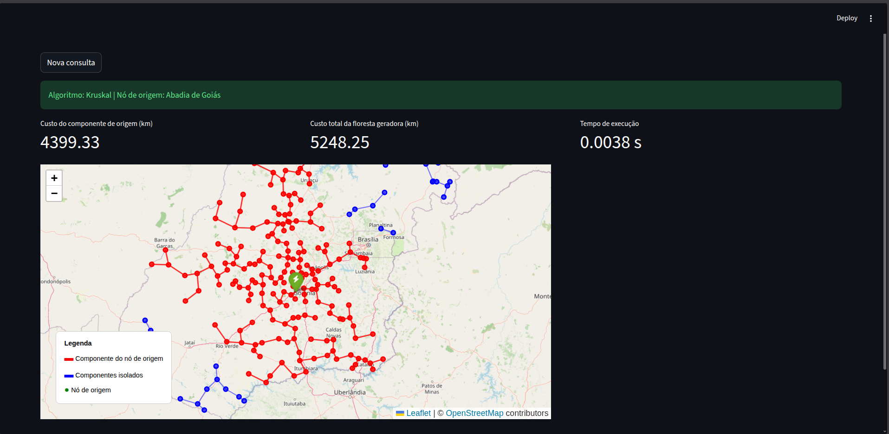

# G34_Grafo_PA-26.1
Repositorio do trabalho do Modulo 1, Grafo, Da disciplina de Projeto de Algoritmos referente ao semestre 2026.1

# NomedoProjeto

Número da Lista: 34<br>
Conteúdo da Disciplina: Grafos<br>

## Alunos
|Matrícula | Aluno |
| -- | -- |
| 211062867  |  Felipe de Jesus Rodrigues |
| 211043763  |  Ruan Sobreira Carvalho |

## Sobre 
Projeto G34: Otimizador de rede elétrica para municípios de Goiás usando algoritmos Kruskal e Prim para Árvores Geradoras Mínimas (MST).

**Funcionalidades:**
- Gera grafo ponderado (distâncias Haversine ≤ distância máx.) a partir de coordenadas de municípios (dataset [Municipios-Brasileiros](https://github.com/kelvins/Municipios-Brasileiros), UF=52).
- App web Streamlit: Seleciona algoritmo, distância máx., origem → Visualiza MST no mapa Folium (componente origem vermelho, isolados azul).
- CLI: Consulta rotas entre cidades na MST.
- Métricas: Custo total/componente, tempo execução.

## Screenshots

Tela principal com a escolha entre os algoritmos Kruskal ou Prim, um slide para definir a distância máxima de conexão entre os municípios em km e o munícipio origem.



Resultado da geração da MST, utilizando o Prim. É exibido métricas como Custo do componente de origem (km), Custo total da floresta geradora (km) e o tempo de execução em segundos.


Visualização em um mapa geoespacial com os componentes que fazem parte da MST (linha vermelha) e os componentes que ficaram isolados (linha azul). Este resultado depende da distância máxima de conexão entre os municípios selecionado na tela inicial.



## Instalação 
**Linguagem:** Python 3.10+  
**Framework:** Streamlit + Folium  

1. Clone o repositório.
2. Instale dependências:  
   ```
   pip install -r requirements.txt
   ```
3. Certifique-se de que `datasets/` contém `municipios.csv` (Goiás UF=52).

**Gera grafo automaticamente na primeira execução (salva em `datasets/grafoPonderadoMunicipios.csv`).**

## Uso 

### Web App
```
streamlit run app.py
```
- Abra http://localhost:8501.
- Escolha algoritmo (Kruskal/Prim).
- Ajuste distância máx. (50-500km).
- Selecione origem → Clique "Gerar" → Veja mapa + métricas.

## Outros 
- **Dataset:** Coordenadas municípios Goiás de https://github.com/kelvins/Municipios-Brasileiros.
- **Grafo:** Gerado dinamicamente com filtro distância (Haversine), salvo em `datasets/grafoPonderadoMunicipios.csv`.
- Projeto acadêmico G34 - Projeto de Algoritmos 2026.1.

## Vídeo apresentação

O vídeo de apresentação pode ser acessado clicando no link abaixo.

[Apresentação](https://youtu.be/UvSfPQxKnwY)